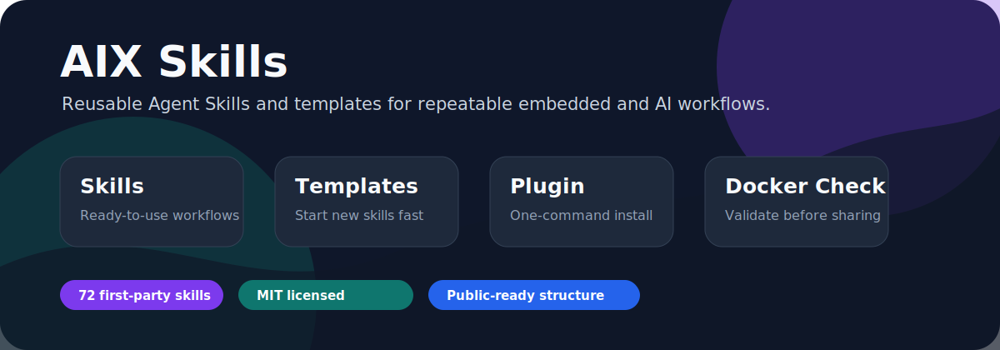
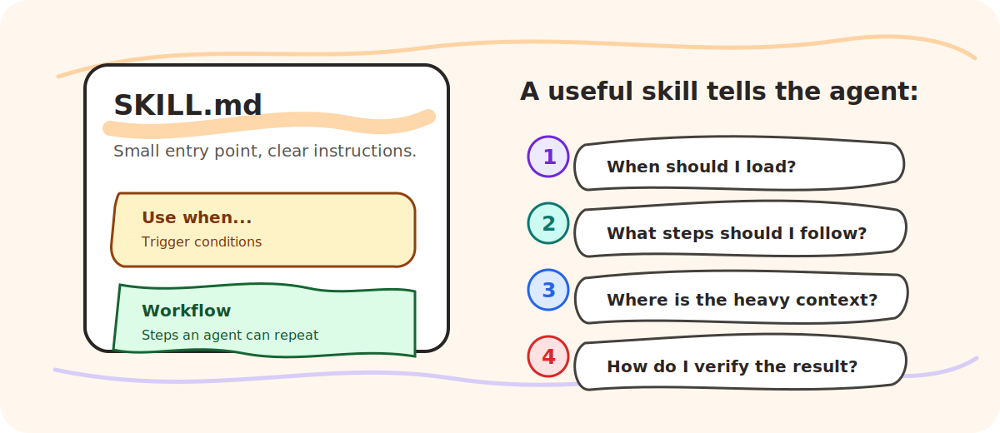
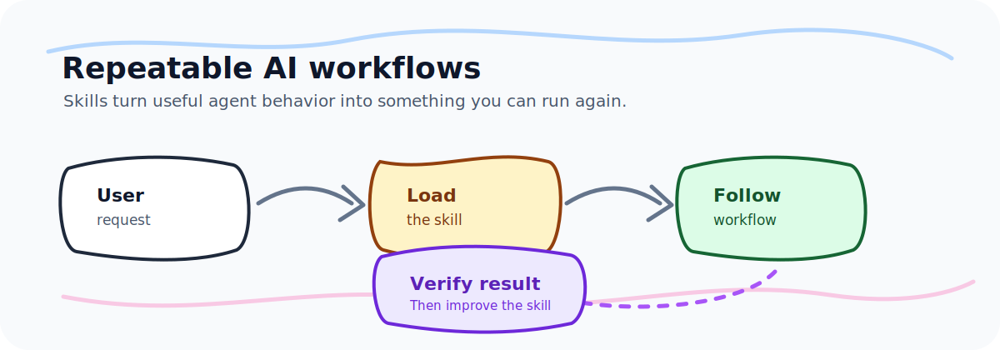

# AIX Skills

[English](README.md) | 简体中文



AIX Skills 是一个公开的 Agent Skills 集合，提供可直接使用的 skills、创建 skills 的模板，以及精选外部资源目录。

本仓库采用混合型结构：一部分是自研 skills，一部分是模板和规范，另一部分是 awesome 资源索引。目标是让读者既能拿来用，也能照着规范贡献新的 skill。

## 什么是 Agent Skill？

Agent Skills 是面向特定任务的说明、脚本和参考资料，AI agent 可以在相关任务出现时动态加载。一个好的 skill 会告诉 agent 什么时候使用、如何执行，以及应该避免哪些错误。



一个好的 skill 应该具备：

- 清晰的触发条件：什么时候应该加载它。
- 可重复的流程：agent 可以按步骤稳定执行。
- 轻量的上下文：主文件聚焦核心流程，重资料放到独立引用文件。
- 可验证的结果：说明如何检查 skill 是否被正确使用。

## 仓库结构

```text
.
├── skills/                 # 本仓库维护的自研 skills
├── template/               # 创建新 skill 的可复制模板
├── awesome/                # 精选外部 skills 和参考资源
├── docs/                   # 编写、维护和发布指南
├── scripts/                # 仓库校验工具
├── CONTRIBUTING.md         # 贡献指南
└── README.md
```

## 当前 Skills

| Skill | 用途 |
| --- | --- |
| `readme-writing` | 帮助 agent 编写更有吸引力、更可信、带有清晰快速开始路径的 README。 |
| `skill-writing-guide` | 指导 agent 为本仓库编写简洁、可发现、可验证的 skills。 |
| `webpage-to-markdown` | 将公开网页 URL 转换为干净的 Markdown 内容。 |

每个 skill 都放在 `skills/` 下的独立目录中，并以 `SKILL.md` 作为入口文件。

## 快速开始

把某个 skill 复制到你的 agent skill 目录中，或使用你的运行环境支持的 skill 管理器安装。

```bash
cp -R skills/webpage-to-markdown ~/.claude/skills/
```

创建新 skill 时，从模板开始：

```bash
cp -R template/skill-template skills/my-new-skill
```

编辑 `skills/my-new-skill/SKILL.md` 后运行校验：

```bash
python3 scripts/validate-skills.py
```

## 设计原则



- **小核心，重参考外置**：`SKILL.md` 应该便于快速扫描，长参考资料放到 supporting files。
- **描述字段先写触发条件**：frontmatter 的 `description` 说明何时使用，而不是复述完整流程。
- **一个高质量示例胜过多个泛泛示例**：示例应该真实、可迁移。
- **默认适合公开发布**：避免 secrets、私有链接、公司内部假设和未授权复制内容。
- **结果必须可验证**：说明 agent 如何证明 skill 被正确使用。

## 参考项目

本仓库参考了：

- [google/skills](https://github.com/google/skills)：产品和 Google Cloud 方向的 skill packs。
- [anthropics/skills](https://github.com/anthropics/skills)：skill 结构、模板和示例。
- [ComposioHQ/awesome-claude-skills](https://github.com/ComposioHQ/awesome-claude-skills)：按主题组织的 skills 资源目录。

## 贡献

欢迎贡献。提交 PR 前请阅读 `CONTRIBUTING.md`，并运行：

```bash
python3 scripts/validate-skills.py
```

## License

MIT. See `LICENSE`.
